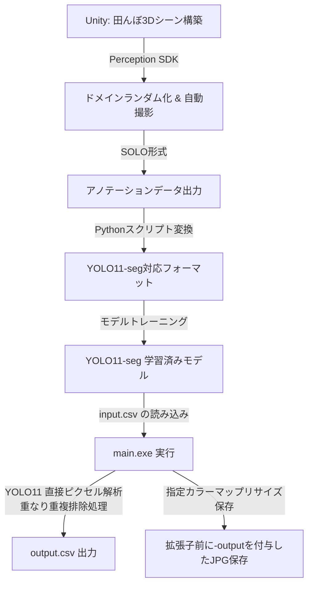

# 3D合成データとYOLO11を用いた田んぼの雑草・稲の自動セグメンテーション＆占有率計測システム

Unityの3D空間上でリアルな田んぼ環境を再現し、Perception SDKを用いて、現実世界では収集・アノテーション（ラベル付け）が困難な「稲」と「雑草」の教師データを大量に自動生成します。このデータを用いて最新のYOLO11-seg（インスタンスセグメンテーションモデル）を学習させ、実環境またはシミュレーション画像から、雑草と稲のピクセル数を正確にカウントして、圃場（ほじょう）の雑草発生状況や稲の生育密度を定量的に出力するシステムを構築するプロジェクトです。

本パッケージには、画像リストのバッチ処理（CSV入出力）および、Windows環境でスタンドアロン実行が可能な実行ファイル（.exe）化パッケージのビルド仕様が含まれています。

---

## プロジェクト概要 (Project Overview)

本プロジェクトは、スマート農業の実現に向けた、CG合成データとディープラーニングを組み合わせた画像解析パッケージです。

- Unity & Perception SDKによるアノテーション自動化: 面倒なポリゴンアノテーション作業をシミュレータ上で自動実行。
- YOLO11-seg による高精度リアルタイムセグメンテーション: 高速かつ精密な領域検出。
- ダイレクトテンソル解析によるピクセル計測: 領域マスクデータをメモリ上で重複排除しながら直接集計し、高速にピクセル数と雑草比率を算出。
- バッチ処理 & CLI / .exe化: input.csv から一括で複数画像を読み込み、解析結果のCSVおよび可視化JPGを出力するWindowsスタンドアロンアプリに対応。

---

## システムアーキテクチャ (System Architecture)



---

## セットアップと環境構築 (Setup & Installation)

本システムをローカルで実行、または .exe にビルドするための手順です。
Python（バージョン3.8以上推奨）がすでにシステムにインストールされている前提で進めます。


### 1. 仮想環境 (venv) の作成と有効化
他のシステムライブラリとの衝突を防ぐため、クリーンな仮想環境を作成します。

* Windows (Command Prompt / コマンドプロンプト):
  ```cmd
  python -m venv venv
  call venv\Scripts\activate
  ```
* Windows (PowerShell):
  ```powershell
  python -m venv venv
  .\venv\Scripts\Activate.ps1
  ```
* macOS / Linux:
  ```bash
  python3 -m venv venv
  source venv/bin/activate
  ```

### 2. 依存ライブラリの一括インストール
YOLO11（Ultralytics）や画像処理、実行ファイル化に必要なパッケージをインストールします。
```bash
pip install --upgrade pip
pip install ultralytics opencv-python numpy pyinstaller
```

---

## 開発フェーズ (Development Phases)

### Phase 1: Unity ＆ Perception SDK によるデータ生成
1. 3Dシーン構築: 
   - 稲、複数種の雑草、水面、土、畔などの3Dアセットを配置。
   - 稲と雑草に Labeling コンポーネントを付与（例: Rice, Weed）。
2. ドメインランダム化 (Domain Randomization):
   - カメラの画角、解像度、照明（太陽光の角度・色）、風による植物の揺れ、雑草の発生密度・サイズを1フレームごとにランダムに変化させ、多様な環境の教師データを自動生成。
3. データ出力:
   - 生のRGB画像と、セグメンテーション用のアノテーション（SOLO形式のJSONおよびセグメンテーション画像）を自動で数千〜数万枚規模で出力。

### Phase 2: YOLO11-seg によるモデル学習
1. データ変換:
   - Unity Perception SDKが出力するSOLOフォーマットを、YOLO11-segで読み込めるポリゴン座標テキスト形式に変換。
2. モデルトレーニング:
   - Ultralytics フレームワークを使用し、事前学習済みモデル yolo11n-seg.pt などをベースに転移学習を実行。

### Phase 3: 推論およびYOLO11による直接ピクセル解析・出力
1. 入力データの読み込み (input.csv):
   - カレントフォルダから画像リストを読み込み、指定されたN回数のループで順次画像を受け取ります。
2. YOLO11 テンソルによる直接ピクセルカウント:
   - 重なり合う個体のピクセル重複を排除するために、各インスタンスマスクの論理和（OR結合）を取ってから総ピクセル数をカウント。
   - 雑草比率 r [%] の計算式（小数点以下2桁目を四捨五入）:
     $$r [\%] = \frac{w}{p + w} \times 100.0$$
     *( p : 水稲画素数, w : 雑草画素数 )
3. 出力画像の生成・保存:
   - 以下のカラー定義に従い、元の画像サイズにリサイズしたカラーマップJPGを、入力ファイル名の拡張子前に -output を追加して保存。
     - 水稲 (p) : 灰色 (0x80, 0x80, 0x80)
     - 雑草 (w) : 白色 (0xff, 0xff, 0xff)
     - その他 (背景) : 黒色 (0x00, 0x00, 0x00)
4. 解析結果の出力 (output.csv):
   - 処理した画像数や、各画像のピクセル解析結果をカレントフォルダに保存。

---

## 入出力データ仕様 (Data Specifications)

### 入力テキスト仕様: input.csv (カレントフォルダに配置)
```text
[処理画像数 N]
[画像幅(width)], [画像高さ(height)], [入力画像ファイルの相対パス]
...（N行繰り返し）
```
例:
```csv
2
1920,1080,000/P1060881.JPG
1280,720,000/P1060882.JPG
```

### 出力テキスト仕様: output.csv (カレントフォルダに自動生成)
```text
[処理した画像数 N]
[画像幅], [画像高さ], [出力画像パス], [判定結果], [水稲画素数p], [雑草画素数w], [雑草比率r]
...（N行繰り返し）
```
例:
```csv
2
1920,1080,000/P1060881-output.JPG,WARNING,518400,103680,16.7
1280,720,000/P1060882-output.JPG,OK,420100,21000,4.8
```

---

## 実行およびビルド方法 (How to Run & Build)

### A. Pythonスクリプトのまま直接実行する場合
1. 仮想環境（venv）が有効になっていることを確認します。
2. 同一フォルダ内に best.pt、input.csv を配置します。
3. 以下のコマンドを実行します。
   ```bash
   python main.py
   ```

### B. Windows実行ファイル (.exe) をビルドして実行する場合
1. 仮想環境が有効な状態で、PyInstallerを使ってビルドを行います。
   ```bash
   pyinstaller --onefile --console main.py
   ```
2. ビルド完了後、dist/main.exe を取り出し、以下のように配置して実行してください。

```text
📁 実行フォルダ/
├── 📄 main.exe         (distフォルダから移動)
├── 📄 best.pt         (学習済みYOLO11セグメンテーションモデル)
├── 📄 input.csv       (処理する入力データリスト)
└── 📁 000/            (画像用フォルダ)
    └── 🖼️ P1060881.JPG
```
